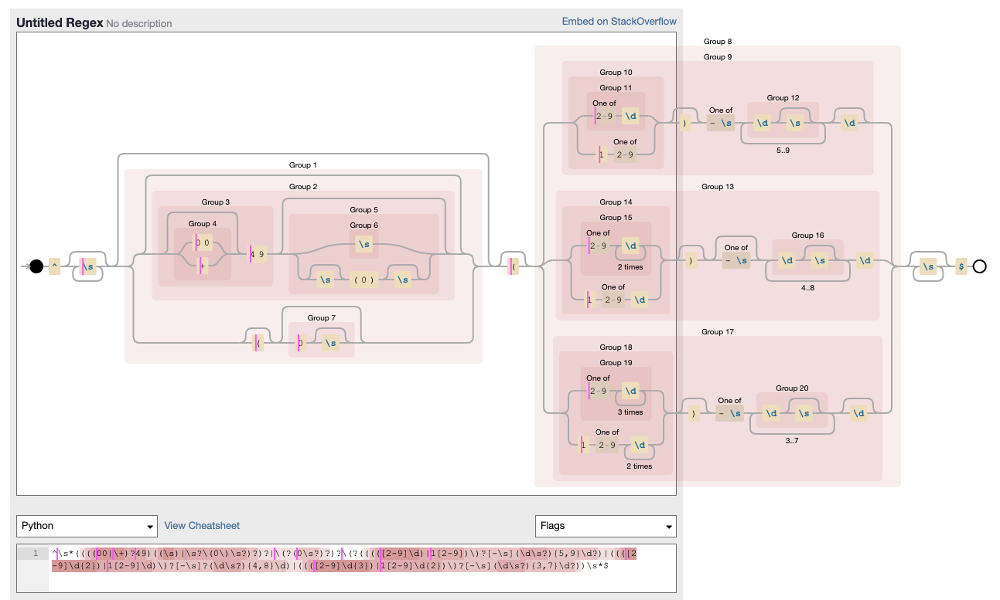

# multinational-retail-data-centralisation

## Tracking my progress.

6th Nov: data cleaning

- I started by importing the user_data variable from my data_extraction module - this contains the pandas dataframe to be cleaned.
- I examined the table.
- I made a copy of the table so that I could test my fixes without altering the original dataframe. Once I knew how to fix it I would code it in the class method.
- I set the index column to the already named "index" column
- I checked the the number of unique index values matched the number of rows in the table using `ud_copy.index.nunique()`
- I examined the datatypes in the database - these were all objects.
- First I converted the "first_name" and "last_name" columns to "string" datatypes.
- Then I went about converting the DOB column to a datetime value. This was trickier because - when I looked at the head of the dataframe, the date values seemed to be uniformatlly presented, but I soon discovered that the dates were present in many different formats. And there were also non-date-type values too.
- I had first used a mask to extract the DOB values that wouldn't be parsable by a simple `pd.to_datetime()` method with the format argument `format='%Y-%m-%d'`. Here I realised that there were many other date-formats to parse, as well as non-date values:
```
mask = pd.to_datetime(ud_copy.date_of_birth, format='%Y-%m-%d', errors='coerce').notna()
inverted_mask = np.invert(mask)
ud_copy.date_of_birth[inverted_mask].unique()
```
This showed me certain values:
!()[readme-images/code-snippet-1.png]

- I experimented with `dateutil.parser` `parse` method: `ud_copy['date_of_birth'] = ud_copy['date_of_birth'].apply(parse)` But because of the non-datetype values, the method was throwing a ParserError at the first non-date value, and I wasnt able to find a way around this.
- I eventually circled back to the `pd.to_datetime()` method, passing it the format argument `'mixed`: `ud_copy.date_of_birth = pd.to_datetime(ud_copy.date_of_birth, format='mixed', errors='coerce')`
- I checked the erroneous valids would be successfully deleted using this method:

```
mask2 = pd.to_datetime(ud_copy.date_of_birth, format='mixed', errors='coerce').notna()
inverted_mask2 = np.invert(mask2)
ud_copy.date_of_birth[inverted_mask2].unique()
```

- I then viewed the dateframe in `sort_value` mode according to `date_of_birth` (`ud_copy.sort_values(by='date_of_birth', axis=0).tail(50)`)and noticed that there were other columns that had the same mixed letter and number string types that I had seen polluting the DOB column.
- I went back to the "first_name" column, and used a regex expression to match all the rows that had a numerical digit in the first name:

`ud_copy.loc[ud_copy["first_name"].str.match(".*[0-9]+.*", "first_name")]`

 these rows had uniformally bogus data (I took a screenshot of this) across the columns, so I deleted all of them:

 ```
mask = ud_copy['first_name'].str.contains(pat='[0-9]', regex=True)
ud_copy = ud_copy[~mask]
 ```
I checked the last_name column didn't have any numerical digits after this too.

 > Note to self: If I deleted these rows first, I may be able to use the dateutil.parser parse method on the DOB to datetime casting. Check if it is more reliable than pandas built-in method with `format='mixed'`.

- When I called the `.describe()` method on the DOB column after making these fixes, I noticed an age range from 1938 (which was plausible, making this person 85 years old) to 2006, which I believed to be potentially plausible but dubious - this person would be 16, almost 17, at the time of writing, so it might be a value worth querying with the data provider.

- Additionally to the "bogus" data rows , there are also "NULL" value data rows" - delete all rows where the first-name is nUll- at first tried dropna() but wasn'st working - realised that they were "NULL" strings.

- also converted join_date to datetime with same method as before. Called .describe() on the edited df - joining dates between 1992 and 2022 which seems reasonable.

- converted other string-value columns to string usng same method as before

- searched for unique values in Country code: ['DE', 'GB', 'US', 'GGB']

```
for code in ud_copy['country_code'].unique():
    print(f"unique values for country code {code}: ", ud_copy[['country', 'country_code']][ud_copy['country_code'] == code]['country'].unique())
```
Result was:
```
unique values for country code DE:  ['Germany']
unique values for country code GB:  ['United Kingdom']
unique values for country code US:  ['United States']
unique values for country code GGB:  ['United Kingdom']
```

So only have the 'GGB' value to correct- the rest match up correctly.

### Phone numbers

Used this regex expression from the internet:
```
"^(((\+44\s?|0044\s?)?|(\(?0))((2[03489]\)?\s?\d{4}\s?\d{4})|(1[23456789]1\)?\s?\d{3}\s?\d{4})|(1[23456789][234578][0234679]\)?\s?\d{6})|(1[2579][0245][0467]\)?\s?\d{5})|(11[345678]\)?\s?\d{3}\s?\d{4})|(1[35679][234689]\s?[46789][234567]\)?\s?\d{4,5})|([389]\d{2}\s?\d{3}\s?\d{4})|([57][0-9]\s?\d{4}\s?\d{4})|(500\s?\d{6})|(7[456789]\d{2}\s?\d{6})))$"
```
Applied it to the range of UK telephone numbers in the dataframe (9371) in total. It divided this set into 6070 valid UK numbers and 3301 invalid uk numbers. Looking at the invalid ones, there are many here that should be accounted for. So I don't think this is the best regex. Find another...

Tried this regex expression next:
```
r'^(?:(?:\(?(?:0(?:0|11)\)?[\s-]?\(?|\+)44\)?[\s-]?(?:\(?0\)?[\s-]?)?)|(?:\(?0))(?:(?:\d{5}\)?[\s-]?\d{4,5})|(?:\d{4}\)?[\s-]?(?:\d{5}|\d{3}[\s-]?\d{3}))|(?:\d{3}\)?[\s-]?\d{3}[\s-]?\d{3,4})|(?:\d{2}\)?[\s-]?\d{4}[\s-]?\d{4}))(?:[\s-]?(?:x|ext\.?|\#)\d{3,4})?$'

uk_subset = ud_copy[ud_copy['country_code'] == 'GB']

valid_uk_nos = uk_subset['phone_number'].str.match(uk_tel_regex)

uk_subset_with_valid_uk_nos = uk_subset[valid_uk_nos]
uk_subset_with_invalid_uk_nos = uk_subset[~valid_uk_nos]

uk_subset_with_invalid_uk_nos[['country_code', 'phone_number']] # 8920 rows
uk_subset_with_valid_uk_nos[['country_code', 'phone_number']] # 451 rows
```
Much better result - 451 columns out of the total invalid. Did a spot check and it looked correct.

For the US version, I couldn't find one that did everything I needed it to do, so I hobbled some regex together from different places and then I had fun on the regex visualiser tool debuggex.com[debuggex.com] honing it until it worked. It might need some further honing to catch other exceptions.

-verified that all the "user_uuid" values were unique (number of unique values matched number of values)

German phone number validation was harder.
- I ran searches on the German phone number subset of the user data to see if the numbers contained any extensions, dashes or forward slashes - they did not. They did have a mixed format of dialling codes being included versus omitted, and brackets being used.
- Most landline numbers have 11 digits, but the number of digits in a German phonen number (not including the country code, and starting from the first 0), can range from 9 to 13 in length. The area code, including the 0 at the start of the number, can range from 3 to 5 digits in length. Neither the second digit nor third digit of the phone number can be a 0. If the second digit is a 1, the third digit cannot also be 1, so must be a number between 2 and 9. Are codes might by presented between brackets.
- Decision to make - whether to accept numbers provided without an area code - I decided not for the time being.
- In terms of the digits that appear after the area code, I allowed for flexibility and errors in formatting conventions by allowing spaces to be entered at any point, including trailing whitespace at the end.
- Also allowed for the posssibility of the number being entered with or without the country dialling code, with or without the 0 starting the number itself, and with or without a (0) after the country dialling code if used.



- When I tested the regular expression on my German number subset, out of 4708 entries, 576 came up as invalid. I spot checked 50 of these and all were confirmed to be invalid based on the rules above. (Most had invalid combinations of 0's or 1's in their first 3 digits.)

### To do list for further refining the data cleaning:
- Is 0 a valid street number? See address field.
- format phone numbers to remove country code
- improve regex for US and UK
- refactor code - make modular
- check for duplicate data

### Issues I encountered:
- I was trying to use subsets to replace erroneous values. I modified this by accessing the filtered data using .loc that combined a conditional filtering for the subset of data and a mask identifying the regex matches (or non-matches).
