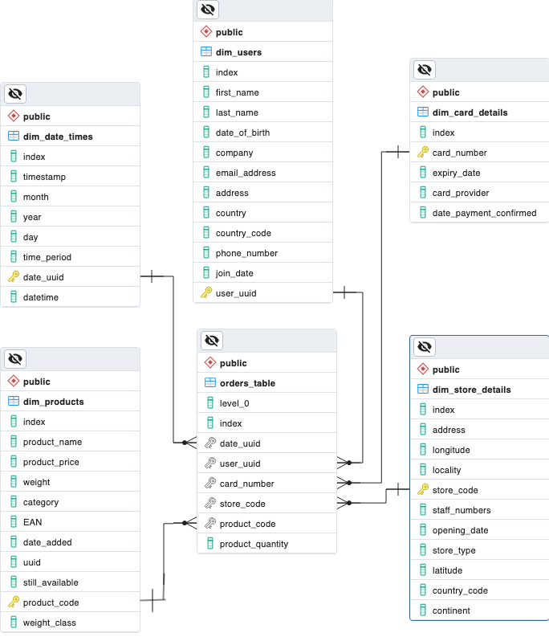

# Multinational Retail Data Centralisation

*Software Engineering & Data Manipulation Project - [AiCore](https://www.theaicore.com/) (November 2023)*


              

                  

**The brief for this project was to build a centralised data solution for a multinational retail organisation, whose sales data was spread across many different data sources.**

**Once the database was in place, I conducted data analysis to extract valuable insights for the company from the newly centralised data. The results demonstrate how the new data solution gives the client the power to make informed business decisions by enabling complex cross-examination of its large datasets from one centralised location.**

## Table of Contents
* [Project Overview](#project-overview)
* [File Structure](#file-structure)
* [Installation](#installation)
* [Usage](#usage)
* [Findings of Data Analysis](#findings-of-data-analysis)
* [Licence](#licence)

## Project Overview

The main implementation of the project is a Python program that extracts, cleans and imports the different datasets into a PostgreSQL database. The resulting database is organised according to a star-based schema for optimised data storage and access.

The database is produced in three phases:

1.  Extracting the large datasets from multiple and varied data sources, including AWS RDS databases, AWS S3 buckets and API endpoints, and of filetypes and datatypes including PDF, CSV, JSON and postgreSQL database tables.

2. Cleaning the extracted data in Pandas: removing rows with entirely null or erroneous values, addressing typos in string values, such as non-numeric characters in alphanumeric fields, replacing isolated invalid values with NaN or Null, type- and downcasting columns. This was to ensure consistency in the data uploaded to the local server.

3. Uploading the cleaned datasets to a local PostgreSQL database, and finalising the database schema by type- and down-casting table columns, editing and creating columns and adding key constraints. All of these measures serve to optimise the data storage and access.

The final phase of the project leverages the centralised data to extract valuable insights through data analysis:

4.  I answered a series of questions about the company's sales data using SQL. The results of these queries, which can be seen [below](#findings-of-data-analysis), provide some concrete examples of the kind of complex data analytics this new database schema makes possible.

## File Structure

In the inner project directory, `multinational-retail-data-centralisation`, there are two sub-directories:
- `db_setup` contains the scripts that implement the data solution:
    - The top-level utility classes are contained in the scripts:
        - `database_utils.py`
        - `data_extraction.py`
        - `data_cleaning.py`
    - The following scripts contain the child classes defined for each of the datasets:
        - `card_data.py`
        - `date_events_data.py`
        - `orders_data.py` *(which is the dataset populating the single-source-of-truth table sitting at the centre of the star-schema database)*
        - `products_data.py`
        - `stores_data.py`
        - `user_data.py`
    - `__main__.py` executes the extraction, cleaning and uploading of all the datasets, and the finalising of the local database schema
    - `env.yaml` has the conda environment details required for the program
- `querying-the-data` contains a `.sql` script with all the queries executed on the newly created database and a `.csv` file storing the results for each of those queries.

Missing from the repo, but required for the successful execution of the `db_setup` package, are:
- a YAML file containing the credentials for the local database to be loaded into
- a YAML file containing the credentials for the AWS RDS database from which two of the datasets are extracted
- a JSON file containing the authentication credentials for the API from which one of the datasets is extracted

For more details on running the database setup on your local machine, see [Installation](#installation) below.

## Installation
Please note you will not be able to set up this database if you are not a member of AiCore, since three of the datasets are private resources and require access to private authentication credentials.

If you have access to those credentials, follow these instructions to recreate the database on your local machine:

1. Recreate the miniconda environment required for the program to run using the `env.yaml` file provided:
```
$ conda env create -f env.yaml -n multinational-retail-data-centralisation
```
2. To set-up the database on your local machine, you'll first need to initialise a new postgresql database locally. I chose to use pgAdmin 4 as the graphical database management system for this.

Open your terminal in a directory of your choosing and clone this repository:
```
$ git clone https://github.com/hillaabra/multinational-retail-data-centralisation.git
```
Get inside the `db_setup` directory:
```
$ cd multinational-retail-data-centralisation/db_setup
```
Create a `.credentials` folder in this directory to hold the credentials information.
```
$ mkdir .credentials
```
3. Using your preferred text editor, add a YAML file to this `.credentials` directory called `local_db_creds.yaml`. This will contain the credentials for the new database. The file should contain the following:
```
DATABASE_TYPE: 'postgresql'
DBAPI: 'psycopg2'
HOST: 'localhost'
USER: 'postgres'
PASSWORD: # insert password
DATABASE: # insert name of database e.g. 'sales_data'
PORT: 5432
```
4. In the same `.credentials` directory, write and save a YAML file called `remote_db_creds.yaml` containing the credentials for the relevant AWS RDS database holding the data for the central orders table and the users dimension table.

5. In the same directory, write and save a JSON file called `api_config.json` containing a key-value pair storing the `x-api-key` needed for the API requests header.

6. If you're working from an IDE, make sure you've selected the miniconda environment created earlier as your interpreter path. If running the program from your computer's terminal, make sure you've activated the environment on the command line:
```
$ conda activate multinational-retail-data-centralisation
```
7. You are now ready to install the database on your local postgres server. This can be done from inside the `db_setup` directory by running:
```
$ python __main__.py
```
 - Or, from its parent directory the next level up, `multinational-retail-data-centralisation`:
```
$ python db_setup
```
## Usage Instructions
The completed database is composed of 5 dimension tables that relate to a single-source-of-truth table at its centre, which contains the definitive reference data for the organisation's retail orders.



SQL queries can be run on the centralised data from within your chosen graphical database management interface, e.g. `pgAdmin 4`, or from an IDE such as `VSCode` using a driver to connect to the database like VS Code's `SQLTools` extension, or from the command line using `psql`.
See the [key findings](#findings-of-data-analysis) below for examples of the database in action.

## Findings of Data Analysis

### 1. How many stores does the business have and in which country?
The operations team wanted to know which countries they currently operate in and which country now has the most stores. The results showed their brick-and-mortar stores are located across the UK, Germany and the US, with most of their stores based in the UK.
```
| country | total_no_stores |
| ------- | --------------- |
| GB      |             266 |
| DE      |             141 |
| US      |              34 |
```
### 2. Which locations currently have the most stores?
The business stakeholders were looking to close some stores before opening more in other locations. To help in their decision of where to close stores, they wanted to know which locations had the most stores at present.

The query produced the following locations as having the most stores:
```
| locality     | total_no_stores |
| ------------ | --------------- |
| Chapletown   |              14 |
| Belper       |              13 |
| Bushey       |              12 |
| Exeter       |              11 |
| Arbroath     |              10 |
| High Wycombe |              10 |
| Rutherglen   |              10 |
```
### 3. Which months of the year produce the largest amounts of sales?
To find out which months of the year have historically produced the most sales, I joined the products and date times dimensions tables onto the orders table and calculated the overal total revenues grouped by month.

The results showed that the month which had historically produced the most sales revenue was August, followed by January, then October.
```
| total_sales | month |
| ----------- | ----- |
|  673,295.68 |     8 |
|  668,041.45 |     1 |
|  657,335.84 |    10 |
|  650,321.43 |     5 |
|  645,741.70 |     7 |
|  645,463.00 |     3 |
```
### 4. How many sales are happening online vs offline?

The company is looking to increase its online sales. They wanted to know how many sales were happening online compared to offline. I calculated how many products have been sold and the amount of sales made (in GBP) for online and offline purchases across the company's sales data history.

The results showed that their offline sales have produced over three times the number and total revenue of sales than their web store.

```
| numbers_of_sales | product_quantity_count | location |
| ---------------- | ---------------------- | -------- |
|           26,957 |                107,739 | Web      |
|           93,166 |                374,047 | Offline  |
```
### 5. What percentage of sales come through each type of store?
The sales team wanted to know which of the different store types generated the most revenue so that they could decide where to focus their efforts.
I calculated the total sales revenue (in GBP) and the percentage of sales coming from each of the different store types.

```
| store_type  |  total_sales | percentage_total(%) |
| ----------- | ------------ | ------------------- |
| Local       | 3,440,896.52 |               44.56 |
| Web Portal  | 1,726,547.05 |               22.36 |
| Super Store | 1,224,293.65 |               15.85 |
| Mall Kiosk  |   698,791.61 |                9.05 |
| Outlet      |   631,804.81 |                8.18 |
```
### 6. Which month in which year produced the highest cost of sales?
The company stakeholders wanted assurances that the company has been doing well recently.
I ran a query to find out which months in which years have had the most sales historically. (The latest sales data is from 2022.) The results show that none of the last three years feature in the company's most profitable months.
```
| total_sales |  year | month |
| ----------- | ----- | ----- |
|   27,936.77 | 1,994 |     3 |
|   27,356.14 | 2,019 |     1 |
|   27,091.67 | 2,009 |     8 |
|   26,679.98 | 1,997 |    11 |
|   26,310.97 | 2,018 |    12 |
|   26,277.72 | 2,019 |     8 |
|   26,236.67 | 2,017 |     9 |
|   25,798.12 | 2,010 |     5 |
|   25,648.29 | 1,996 |     8 |
|   25,614.54 | 2,000 |     1 |
```
### 7. What is the staff headcount?
The operations team wanted to know the overall staff numbers in each location around the world. I performed a query to determine the staff numbers in each of the countries the company sells in.

```
| total_staff_numbers | country_code |
| ------------------- | ------------ |
|              13,307 | GB           |
|               6,123 | DE           |
|               1,384 | US           |
```
### 8. Which German store is selling the most?
The sales team was looking to expand their territory in Germany. I ran a query to determine which type of store had generated the most sales in Germany across the company's sales history.
```
|  total_sales | store_type  | country_code |
| ------------ | ----------- | ------------ |
|   198,373.57 | Outlet      | DE           |
|   247,634.20 | Mall Kiosk  | DE           |
|   384,625.03 | Super Store | DE           |
| 1,109,909.59 | Local       | DE           |
```
*(For most of the results above, a query focussing on a window of more recent sales is likely to provide more actionable information, since these queries have been run on sales data spanning three decades.)*

### 9. How quickly is the company making sales?
The sales team wanted an accurate metric for how quickly the company is making sales. I determined the average time taken between each sale, grouped by year.
```
|  year | actual_time_taken                                            |
| ----- | ------------------------------------------------------------ |
| 2,013 | {"hours":2,"minutes":17,"seconds":13,"milliseconds":712.533} |
| 1,993 | {"hours":2,"minutes":15,"seconds":35,"milliseconds":481.806} |
| 2,002 | {"hours":2,"minutes":13,"seconds":39,"milliseconds":915.69}  |
| 2,008 | {"hours":2,"minutes":13,"seconds":3,"milliseconds":770.202}  |
| 2,022 | {"hours":2,"minutes":13,"seconds":2,"milliseconds":3.698}    |
| 1,995 | {"hours":2,"minutes":13,"milliseconds":53.404}               |
| 2,016 | {"hours":2,"minutes":12,"seconds":50,"milliseconds":458.354} |
| 2,011 | {"hours":2,"minutes":12,"seconds":19,"milliseconds":240.745} |
| 2,020 | {"hours":2,"minutes":11,"seconds":58,"milliseconds":890.476} |
| 2,012 | {"hours":2,"minutes":11,"seconds":47,"milliseconds":533.684} |
| 2,021 | {"hours":2,"minutes":11,"seconds":44,"milliseconds":547.326} |
| 2,009 | {"hours":2,"minutes":11,"seconds":18,"milliseconds":622.594} |
| 2,007 | {"hours":2,"minutes":11,"seconds":8,"milliseconds":918.642}  |
| 2,010 | {"hours":2,"minutes":11,"seconds":7,"milliseconds":808.24}   |
| 1,999 | {"hours":2,"minutes":11,"seconds":5,"milliseconds":102.046}  |
| 1,996 | {"hours":2,"minutes":11,"milliseconds":84.763}               |
| 2,000 | {"hours":2,"minutes":10,"seconds":55,"milliseconds":241.739} |
| 2,019 | {"hours":2,"minutes":10,"seconds":40,"milliseconds":488.303} |
| 1,994 | {"hours":2,"minutes":10,"seconds":38,"milliseconds":998.756} |
| 2,018 | {"hours":2,"minutes":10,"seconds":37,"milliseconds":13.92}   |
| 2,001 | {"hours":2,"minutes":10,"seconds":34,"milliseconds":39.781}  |
| 2,004 | {"hours":2,"minutes":10,"seconds":29,"milliseconds":774.281} |
| 2,006 | {"hours":2,"minutes":10,"seconds":15,"milliseconds":623.512} |
| 2,014 | {"hours":2,"minutes":10,"seconds":5,"milliseconds":558.445}  |
| 1,997 | {"hours":2,"minutes":9,"seconds":46,"milliseconds":934.207}  |
| 2,015 | {"hours":2,"minutes":9,"seconds":36,"milliseconds":903.552}  |
| 1,992 | {"hours":2,"minutes":9,"seconds":32,"milliseconds":62.921}   |
| 2,005 | {"hours":2,"minutes":9,"milliseconds":174.073}               |
| 2,017 | {"hours":2,"minutes":8,"seconds":39,"milliseconds":348.444}  |
| 2,003 | {"hours":2,"minutes":8,"seconds":36,"milliseconds":218.084}  |
| 1,998 | {"hours":2,"minutes":8,"seconds":6,"milliseconds":538.161}   |
```
## License Information

This project is currently unlicensed.